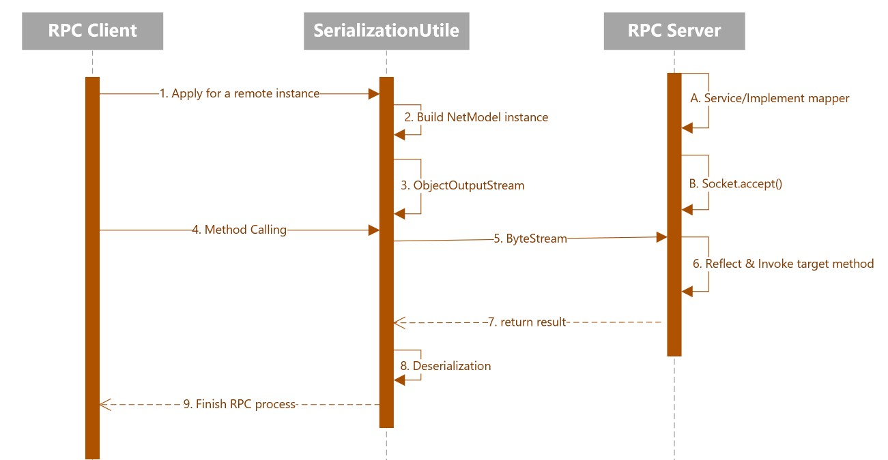

# Lab 1

## Designing and Implementing

The project contains two important parts, a naive implementation of RPC based on Java Serialization and Reflection, and a Bazaar-style P2P market.

+ Dir structure.

```
./
├── Dockerfile
├── README.md
├── args
├── config.yml
├── cs677.lab1.peer0.example.com
│   ├── JSON_FILES
│   │   └── init.json
│   └── Logs
│       └── logs_cs677.lab1.peer0.example.com
│           ├── LOGGER_LOOKUP_SERVICE.log
│           ├── LOGGER_MAIN.log
│           ├── LOGGER_MAIN.log.lck
│           ├── LOGGER_MESURE_RESULT.log
│           ├── LOGGER_MESURE_RESULT.log.lck
│           ├── LOGGER_REPLY_SERVICE.log
│           ├── LOGGER_REPLY_SERVICE.log.lck
│           ├── LOGGER_TRADE.log
│           └── LOGGER_TRADE.log.lck
├── cs677.lab1.peer1.example.com
│   ├── JSON_FILES
│   │   └── init.json
│   └── Logs
│       └── logs_cs677.lab1.peer1.example.com
│           ├── LOGGER_LOOKUP_SERVICE.log
│           ├── LOGGER_MAIN.log
│           ├── LOGGER_MESURE_RESULT.log
│           ├── LOGGER_MESURE_RESULT.log.lck
│           ├── LOGGER_REPLY_SERVICE.log
│           ├── LOGGER_REPLY_SERVICE.log.lck
│           ├── LOGGER_TRADE.log
│           └── LOGGER_TRADE.log.lck
├── cs677.lab1.peer2.example.com
│   ├── JSON_FILES
│   │   └── init.json
│   └── Logs
│       └── logs_cs677.lab1.peer2.example.com
│           ├── LOGGER_LOOKUP_SERVICE.log
│           ├── LOGGER_MAIN.log
│           ├── LOGGER_MESURE_RESULT.log
│           ├── LOGGER_MESURE_RESULT.log.lck
│           ├── LOGGER_REPLY_SERVICE.log
│           ├── LOGGER_REPLY_SERVICE.log.lck
│           ├── LOGGER_TRADE.log
│           └── LOGGER_TRADE.log.lck
├── docker-compose.yml.bak
├── host
├── outputmarker.txt
├── pom.xml
├── rundocker.sh
├── src
│   ├── main
│   │   ├── java
│   │   │   └── lab1
│   │   │       ├── App.java
│   │   │       ├── api
│   │   │       │   ├── bean
│   │   │       │   │   ├── Buyer.java
│   │   │       │   │   ├── Person.java
│   │   │       │   │   ├── Seller.java
│   │   │       │   │   ├── Transaction.java
│   │   │       │   │   ├── basic
│   │   │       │   │   │   ├── Address.java
│   │   │       │   │   │   ├── BasicResponse.java
│   │   │       │   │   │   ├── NetModel.java
│   │   │       │   │   │   ├── PeerBase.java
│   │   │       │   │   │   ├── Product.java
│   │   │       │   │   │   └── factories
│   │   │       │   │   │       └── SingletonFactory.java
│   │   │       │   │   ├── config
│   │   │       │   │   │   ├── InitConfigForBuyer.java
│   │   │       │   │   │   ├── InitConfigForSeller.java
│   │   │       │   │   │   ├── ProfilesBean.java
│   │   │       │   │   │   └── basic
│   │   │       │   │   │       └── InitConfigBasic.java
│   │   │       │   │   └── freemarker
│   │   │       │   │       └── DockerComposeFileModel.java
│   │   │       │   └── util
│   │   │       │       ├── LoggerFormator.java
│   │   │       │       ├── LuckyPrinter.java
│   │   │       │       ├── ProductDeSerializer.java
│   │   │       │       ├── ProductSerializer.java
│   │   │       │       ├── ProfilesGenerator.java
│   │   │       │       └── SerializeUtils.java
│   │   │       ├── constants
│   │   │       │   ├── Const.java
│   │   │       │   └── ResponseCode.java
│   │   │       ├── rpcClient
│   │   │       │   ├── RpcClient.java
│   │   │       │   └── proxy
│   │   │       │       ├── ProxyFactory.java
│   │   │       │       └── RPCInvocationHandler.java
│   │   │       └── rpcServer
│   │   │           ├── RpcServer.java
│   │   │           └── service
│   │   │               ├── HelloService.java
│   │   │               ├── LookupService.java
│   │   │               ├── PurchaseService.java
│   │   │               ├── ReplyService.java
│   │   │               └── impl
│   │   │                   ├── HelloServiceImpl.java
│   │   │                   ├── LookupServiceImpl.java
│   │   │                   ├── PurchaseServiceImpl.java
│   │   │                   └── ReplyServiceImpl.java
│   │   └── resources
│   │       ├── config.properties
│   │       ├── config.yml
│   │       ├── init.json
│   │       ├── init1.json
│   │       ├── init2.json
│   │       └── initSeller.json
│   └── tests
├── static
│   ├── image-20221030175151792.png
│   ├── image-20221030184822874.png
│   └── image-20221030190349411.png
├── target
│   ├── archive-tmp
│   ├── classes
│   │   ├── config.properties
│   │   ├── config.yml
│   │   ├── init.json
│   │   ├── init1.json
│   │   ├── init2.json
│   │   ├── initSeller.json
│   │   └── lab1
│   │       ├── App.class
│   │       ├── api
│   │       │   ├── bean
│   │       │   │   ├── Buyer.class
│   │       │   │   ├── Person.class
│   │       │   │   ├── Seller.class
│   │       │   │   ├── Transaction.class
│   │       │   │   ├── basic
│   │       │   │   │   ├── Address.class
│   │       │   │   │   ├── BasicResponse.class
│   │       │   │   │   ├── NetModel.class
│   │       │   │   │   ├── PeerBase.class
│   │       │   │   │   ├── Product.class
│   │       │   │   │   └── factories
│   │       │   │   │       └── SingletonFactory.class
│   │       │   │   ├── config
│   │       │   │   │   ├── InitConfigForBuyer.class
│   │       │   │   │   ├── InitConfigForSeller.class
│   │       │   │   │   ├── ProfilesBean.class
│   │       │   │   │   └── basic
│   │       │   │   │       └── InitConfigBasic.class
│   │       │   │   └── freemarker
│   │       │   │       └── DockerComposeFileModel.class
│   │       │   └── util
│   │       │       ├── LoggerFormator.class
│   │       │       ├── LuckyPrinter.class
│   │       │       ├── ProductDeSerializer.class
│   │       │       ├── ProductSerializer.class
│   │       │       ├── ProfilesGenerator.class
│   │       │       └── SerializeUtils.class
│   │       ├── constants
│   │       │   ├── Const.class
│   │       │   ├── ResponseCode$1.class
│   │       │   └── ResponseCode.class
│   │       ├── rpcClient
│   │       │   ├── RpcClient.class
│   │       │   └── proxy
│   │       │       ├── ProxyFactory.class
│   │       │       └── RPCInvocationHandler.class
│   │       └── rpcServer
│   │           ├── RpcServer.class
│   │           └── service
│   │               ├── HelloService.class
│   │               ├── LookupService.class
│   │               ├── PurchaseService.class
│   │               ├── ReplyService.class
│   │               └── impl
│   │                   ├── HelloServiceImpl.class
│   │                   ├── LookupServiceImpl.class
│   │                   ├── PurchaseServiceImpl.class
│   │                   └── ReplyServiceImpl.class
│   ├── cs677_lab1-1.0-SNAPSHOT-jar-with-dependencies.jar
│   ├── cs677_lab1-1.0-SNAPSHOT.jar
│   ├── generated-sources
│   │   └── annotations
│   ├── maven-archiver
│   │   └── pom.properties
│   └── maven-status
│       └── maven-compiler-plugin
│           └── compile
│               └── default-compile
│                   ├── createdFiles.lst
│                   └── inputFiles.lst
├── templates
│   └── template.ftl
└── testAuto
    ├── Dockerfile
    ├── app.jar
    ├── clear.sh
    ├── config.yml
    ├── cs677*.com
    ├── profileGenerator.jar
    ├── runDocker.sh
    ├── runLocal.sh
    └── templates
        └── template.ftl

61 directories, 140 files
```


+ RPC.

  The basic idea about this part is shown below:

  

+ P2P market rules. (Example for 2 buyers, 1 seller, neighbor = 2)

  

  + The key class is the figure below.
  
  

## How to Deploy

+ To deploy via docker, cd into the working dir:

 ```shell
 cd ${APP_ROOT}/testAuto
 ```

and toggle the `'deployOnSingleComputer'` parameter in config.yml to `‘false’`.

```yaml
deployOnSingleComputer: false
```

Then run the command:

```shell
sh runDocker.sh
```

To stop all containers, run:

```shell
docker-compose down
```

to clean all the temp files and docker images, run:

```
sh clear.sh
```

+ To deploy on a single computer manually, cd into the working dir:

  ```shell
  cd ${APP_ROOT}/testAuto
  ```

  and toggle the `'deployOnSingleComputer'` parameter in config.yml to `‘true’`.

  ```yaml
  deployOnSingleComputer: true
  ```

  then, run the command:

  ```shell
  sh runLocal.sh
  ```

  Run command to add host:

  ```shell
  cat ./host >> /etc/host

​	 finally, open the file “arg”, use the args inside it for each node, and run:

```shell
java -jar app.jar ${ARGS from file "arg"}
```

​	To clean up the temp files, run:

```shell
sh clear.sh
```

## Testing Result

+ Exploring the relationship between parameters and performance

  + Request Number

    ```yaml
    we tested request numbers of [10, 100, 1000, 10000] under the other parameters set of:
    	- sellerNumber: 2
    	- buyerNumber: 4
    	- neighbourNum: 2
    	- maxJump: 5
    	
    result(ms):
    	- 10 times : 1136
    	- 100 times : 1259 
    	- 1000 times : 1370 
    	- 10000 times : 1015.7 
    ```

    Result: Request number dose does not influence performance a lot.

  + Node Number

    ```yaml
    we tested node numbers of [30, 50, 70, 90] with buyers and sellers rate of 8:2 under the other parameters set of:
    	- neighbourNum: 2
    	- requestNum: 1000
    	- maxJump: 5
    
    result(ms):
    	- 30 nodes: 10990.3 
    	- 50 nodes: 26208.5 
    	- 70 nodes: 38892.7 
    	-	90 nodes: 78669.3 
    ```

    Result: As node numbers grow, the average response time increased rapidly because more jumps are needed to find the target seller.

  + Neighbour Number

    ```yaml
    we tested neighbour numbers of [1, 2, 4, 6] the other parameters set of:
    	- sellerNumber: 6
    	- buyerNumber: 24
    	- requestNum: 1000
    	- maxJump: 5
    
    result(ms):
    	- 1 neighbour: 5673.3 
    	- 2 neighbour: 15839 
    	- 4 neighbour: 27038 
    	-	6 neighbour: 45307 
    ```

    Result: As the number of neighbors increases, each request will propagate the request in a wider range and there will be a greater chance of discovering the merchant. But too many neighbors can lead to wasted arithmetic power, so it is important to find a suitable value. For our experiments, 1 neighbor will have better performance.

  + Max Jump Number

    ```yaml
    we tested max jump numbers of [2, 5, 8, 11] the other parameters set of:
    	- sellerNumber: 6
    	- buyerNumber: 24
    	- requestNum: 1000
      -	neighbourNum: 1
    
    result:
    	- 2 max jump: very fast(below than 30 ms), but almost No deal was struck(only 4 successed)
    	- 5 max jump: 6360 
    	- 8 max jump:	7359
    	-	11 max jump: 7405
    ```

    A smaller number of timeouts results in less average transaction response time, but the success rate of the transaction also decreases. An increase in the number of jumps results in a higher success rate, but there is an upper bound on it, and too high a jump limit will not continue to lead to transactions, but will instead result in unnecessary wastage of arithmetic power. For our experiments, the best value to take is 5.

  + Deploy on different hosts

    + We’ve tried deploying nods on two hosts. But they are inside the same home LAN and the router does not load too much. The result did not show a significant difference.  
    + However, we can assume a situation that the nods are separately deployed on different machines between a long distance(with high latency). The average response time is for sure goes high, and the path would not be stable. Because due to the unstable of the WAN, sometimes a longer path with even more jump numbers could be faster than a short path if the WAN of the short path becomes narrow.

## Limitations and Opportunities

+ Some of the problems and Areas for improvement：
  + Java native serialization framework performance does not seem to be particularly good, in the follow-up work can continue to try another serialization framework such as Jackson.
  + The current simple RPC design lacks a discovery mechanism and may require changes to each node's code when new features are added.
  + The current design can only guarantee the ultimate consistency of the results and that no goods will be over- or under-delivered, but if there are nodes that deliberately corrupt the correctness of the data transmission, the data cannot be guaranteed to be correct.
  + The cluster does not implement a mechanism for dynamically adding or dropping nodes.
